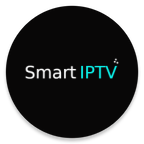
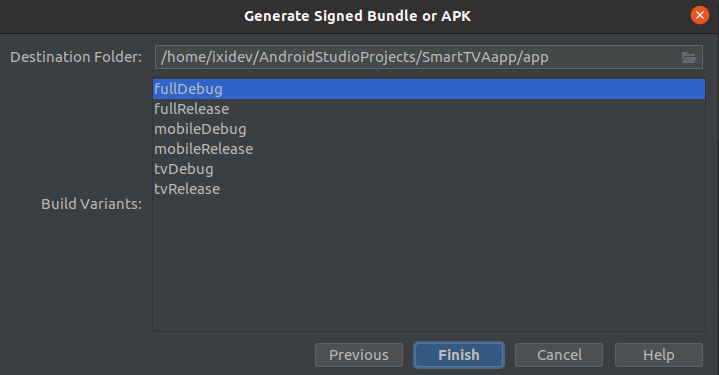

# SmartTVAapp

<p align="center"></p>

>Contact info :
>- Created: 20/04/2019
>- Last Update : 26/04/2020
>- Email : [feedback.mrzero@gmail.com](mileto:feedback.mrzero@gmail.com)
>- WhatsApp :
>  [https://wa.me/message/TZK2WRMXBYG6G1](https://wa.me/message/TZK2WRMXBYG6G1)


>Thank you for purchasing my application. If you have any questions that are beyond
>the scope of this help file, please feel free to email me.
>==========================================================


#### Features

- Android Studio Project
- Build with Kotlin
- Support Android 10 and up
- Support Android Studio 4.1.3 and up
- Easy to Reskin
- AdMob **Banner** & **Interstitial** & **Native Ads**
- Well documented user guide
- Support M3U,M3U8,XSPF and Xtream Accounts
- Dark mode
- Material Design

### Documentation

#### Installing Requirements

- Android Studio 4.1.3 or up
- Internet connection ( first time to build )

#### Opening the project in Android Studio

Now, you have already installed all software's that required configuring
Android project. To openAndroid project follow this steps:
1. Open Android Studio `> File > New > Import Project`
2. In the dialog that opens, browse to the project (or a directory
   containing source files) that you want to import.
3. Then go to 'Build' Menu > Clean Project
4. Wait for few minutes until all errors are gone. Ignore any warning
   appears in 'Problems' tab.

#### Change App Config

Go to [AppConfig.kt](buildSrc/src/main/kotlin/AppConfig.kt) And change
this with your's
- Package name
- App name
- Version name

#### Change AdMob Config

Go to [AdsConfig.kt](buildSrc/src/main/kotlin/AdsConfig.kt)

And Change Unit's IDs and AdMob App Id and Privacy url

```kotlin
 const val HOME_BANNER_AD_ID = "ca-app-pub-3940256099942544/6300978111"
 const val HOME_NATIVE_AD_ID = "ca-app-pub-3940256099942544/2247696110"
 const val ADD_FILE_INTERSTITIAL_AD_ID = "ca-app-pub-3940256099942544/1033173712"
 const val PLAYER_INTERSTITIAL_AD_ID = "ca-app-pub-3940256099942544/1033173712"
 const val DEV_EMAIL = "" // Email for contact
 const val PRIVACY_POLICY_URL = "" // Privacy policy page url for GDPR
 const val ADMOB_PUBLISHER_ID = "" // AdMob publisher ID ( see AdMob doc )
 const val ADMOB_APP_ID = "ca-app-pub-3940256099942544~3347511713" // AdMob App ID
 
```

#### Change App Logo

go to [mipmap](common/src/main/res) and change logo with your's

#### Build Apk or App Bundle
 After finishing setup your code, goto **Build >Generate Signed Bundle/Apk** and enter your Keystore info
 Click next and you will  get this window bellow

 <p align="center"></p>

 This window will be different depend on wish version of code that u buy
 Select
  - fullRelease (Recommended) for full version mobile and tv
  - mobileRelease for mobile ui ( my also work on tv)
  - tvRelease (**beta**) for tv ui only ( **tv version not include ads** )

>On More Step Once again, thank you so much for purchasing this app. As
>I said at the beginning, I would be glad to help you if you have any
>questions relating to this app. Please give it a review.

